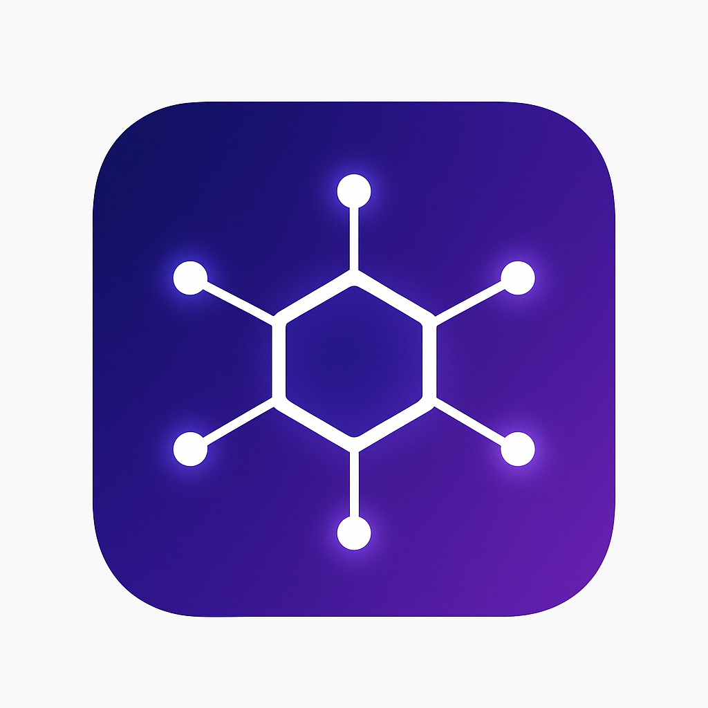
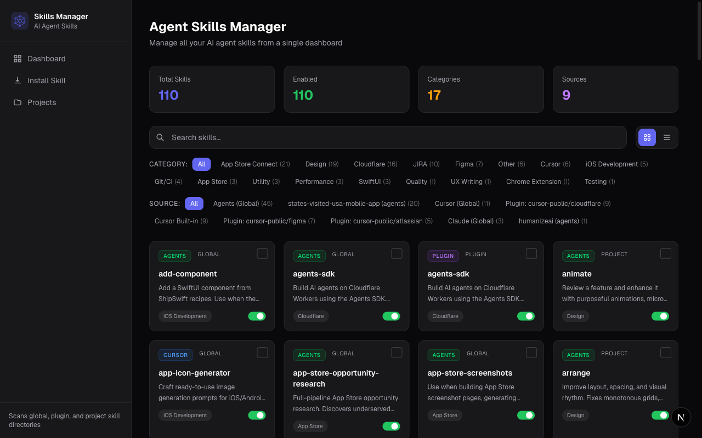

<p align="center">
  
</p>

<h1 align="center">Agent Skills Manager</h1>

<p align="center">
  Manage all your AI agent skills from a single dashboard.<br/>
  Supports <strong>Cursor</strong>, <strong>Claude</strong>, <strong>Windsurf</strong>, <strong>Copilot</strong>, <strong>Codex</strong>, <strong>Cline</strong>, <strong>Aider</strong>, <strong>Continue</strong>, <strong>Roo Code</strong>, <strong>Augment</strong>, and <strong>Agents</strong>.
</p>

<p align="center">
  <a href="#features">Features</a> &bull;
  <a href="#installation">Installation</a> &bull;
  <a href="#usage">Usage</a> &bull;
  <a href="#skill-format">Skill Format</a> &bull;
  <a href="#contributing">Contributing</a> &bull;
  <a href="#license">License</a>
</p>

---

## Screenshots



---

## What is this?

AI coding agents use **skills** and **rules** — markdown files with instructions that extend agent capabilities. These files live scattered across multiple directories on your machine:

```
~/.cursor/skills/          ~/.windsurf/rules/        ~/.roo/rules/
~/.claude/skills/          ~/.cline/rules/           ~/.continue/rules/
~/.agents/skills/          ~/.codex/AGENTS.md        ~/.github/copilot-instructions.md
~/.cursor/plugins/cache/…/skills/                    ~/augment-guidelines.md
your-project/.cursor/skills/    your-project/.windsurf/rules/    ...and more
```

**Agent Skills Manager** gives you a single dashboard to discover, view, edit, enable/disable, install, copy, move, and delete skills across all these locations.

## Features

- **Unified Dashboard** — See all your skills from every source in one place with search, filtering by category/source, and grid or table views
- **Skill Editor** — Edit skills with a CodeMirror-powered editor featuring markdown preview, split view, and syntax highlighting
- **Enable/Disable** — Toggle skills on and off without deleting them (renames between `SKILL.md` and `SKILL.md.disabled`)
- **11 Tools Supported** — Cursor, Claude, Agents, Windsurf, Copilot, Codex, Cline, Aider, Continue, Roo Code, and Augment
- **Multi-source Discovery** — Automatically scans global directories, plugin caches, single-file configs, and project-level skill folders
- **Install from Git** — Clone any Git repository and install discovered skills to your preferred target
- **Manual Creation** — Create new skills with a step-by-step wizard
- **Bulk Actions** — Select multiple skills to copy, move, delete, or toggle in batch
- **Project Management** — Add projects manually or run a full system scan to discover projects with skill directories
- **Smart Categorization** — Auto-categorizes skills into groups like SwiftUI, Cloudflare, App Store Connect, Design, Git/CI, and more
- **Interactive Terminal** — Built-in terminal for CLI-based skill management
- **Cross-tool Install** — Install skills to any supported tool at global or project scope

## Installation

### Prerequisites

- **Node.js** 18+
- **npm** 9+ (or pnpm / yarn)
- A C/C++ compiler toolchain for `node-pty` (native dependency):
  - **macOS**: Xcode Command Line Tools (`xcode-select --install`)
  - **Linux**: `build-essential`, `python3` (`apt install build-essential python3`)
  - **Windows**: [Windows Build Tools](https://github.com/nicknisi/windows-build-tools) or Visual Studio with C++ workload

### Setup

```bash
git clone https://github.com/umutbozdag/agent-skills-manager.git
cd agent-skills-manager
npm install
```

### Run

```bash
# Start both Next.js dev server and the terminal WebSocket server
npm run dev
```

Open [http://localhost:3000](http://localhost:3000) in your browser.

#### Individual servers

```bash
npm run dev:web   # Next.js only (port 3000)
npm run dev:pty   # Terminal WebSocket server only (port 3001)
```

### Build for production

```bash
npm run build
npm start
```

## Usage

### Dashboard

The main page shows all discovered skills with:
- **Search** — Filter by name or description
- **Category filter** — SwiftUI, Cloudflare, Design, Git/CI, etc.
- **Source filter** — Cursor Global, Claude Global, Plugins, Projects
- **Grid / Table view** toggle
- **Stats cards** — Total skills, enabled count, categories, sources

### Managing Skills

Click any skill card to open the detail page where you can:
- View full content with markdown rendering
- Edit with the CodeMirror editor (edit / preview / split modes)
- Toggle enable/disable
- Install to another target
- Delete

### Installing Skills

Three methods available from the **Install** page:

1. **From Git** — Paste a repository URL, the app clones it and lets you pick which skills to install
2. **Manual** — Create a new skill from scratch with a name, description, and content
3. **Terminal** — Use the built-in terminal for CLI-based workflows

### Bulk Operations

Select multiple skills from the dashboard, then use the bulk action bar to:
- **Copy** to another target
- **Move** between targets
- **Delete** selected skills
- **Toggle** enable/disable

### Projects

Add your project directories to discover project-scoped skills, or run a **full system scan** to automatically find projects with `.cursor/skills`, `.claude/skills`, or `.agents/skills` directories.

## Skill Format

Skills are markdown files named `SKILL.md` inside a named directory:

```
skills/
  my-skill/
    SKILL.md
```

Each `SKILL.md` has YAML frontmatter:

```markdown
---
name: my-skill
description: A short description of what this skill does
---

Your skill instructions go here. This is the content that the AI agent
will use when this skill is activated.
```

Disabling a skill renames it to `SKILL.md.disabled` — the file stays in place but agents won't pick it up.

## Supported Tools & Sources

### Directory-based (multiple skills per directory)

| Tool | Global Path | Project Path |
|------|------------|--------------|
| **Agents** | `~/.agents/skills/` | `.agents/skills/` |
| **Cursor** | `~/.cursor/skills/`, `~/.cursor/skills-cursor/` | `.cursor/skills/` |
| **Claude** | `~/.claude/skills/` | `.claude/skills/` |
| **Windsurf** | `~/.windsurf/rules/` | `.windsurf/rules/` |
| **Cline** | `~/.cline/rules/`, `~/.clinerules/` | `.cline/rules/` |
| **Continue** | `~/.continue/rules/` | `.continue/rules/` |
| **Roo Code** | `~/.roo/rules/` | `.roo/rules/` |
| **Cursor Plugins** | `~/.cursor/plugins/cache/…/skills/` | — |

### Single-file (one config file per tool)

| Tool | Global Path | Project Path |
|------|------------|--------------|
| **Copilot** | `~/.github/copilot-instructions.md` | `.github/copilot-instructions.md` |
| **Codex** | `~/.codex/AGENTS.md` | `.codex/AGENTS.md` |
| **Aider** | `~/.aider.conf.yml` | `.aider.conf.yml` |
| **Augment** | `~/augment-guidelines.md` | `augment-guidelines.md` |

## Tech Stack

- **Framework**: [Next.js](https://nextjs.org) 16 with App Router
- **UI**: React 19, Tailwind CSS 4
- **Editor**: [CodeMirror](https://codemirror.net) via @uiw/react-codemirror
- **Markdown**: react-markdown with GitHub Flavored Markdown
- **Terminal**: xterm.js + node-pty via WebSocket
- **Language**: TypeScript 5

## Agent Skill

This repo also includes a standalone **manage-skills** skill that teaches AI agents how to discover, create, edit, copy, move, and delete skills across all 11 tools directly from the terminal — no web UI needed.

### Install the skill

```bash
# For Cursor
cp -r skills/manage-skills ~/.cursor/skills/manage-skills

# For Claude
cp -r skills/manage-skills ~/.claude/skills/manage-skills

# For Agents
cp -r skills/manage-skills ~/.agents/skills/manage-skills
```

Once installed, ask your agent things like:
- "List all my skills across all tools"
- "Create a new skill called code-review for Cursor"
- "Copy my deploy skill from Agents to Claude"
- "Disable the pr-review skill"

## Contributing

Contributions are welcome! Please see [CONTRIBUTING.md](CONTRIBUTING.md) for guidelines.

## License

[MIT](LICENSE) - Umut Bozdag
